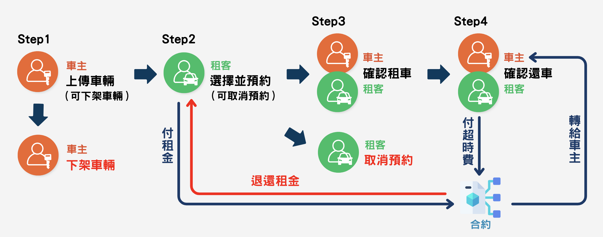

# AirCnC 汽機車共享租賃
###### tags: `Solidity`、`DApp`、`Web`、`blockchain`
###### 後端: [Solidity 程式碼](https://github.com/daniel0203000/AirCnC)


## 專案簡介
AirCnC是一個基於以太坊區塊鏈的汽機車共享租賃平台，旨在提供去中心化的點對點車輛租賃服務。用戶可以註冊成為車主，上傳自己的汽車或機車供他人租用，也可以作為租車者搜尋並預約可用的車輛。整個租賃過程通過智能合約來確保交易的透明性、安全性和可靠性。

## 技術架構
- **前端**：HTML、CSS、JavaScript、Bootstrap
- **區塊鏈**：以太坊、Solidity智能合約
- **Web3連接**：MetaMask、Web3.js
- **資料存儲**：IPFS (用於車輛圖像存儲)

## 主要功能

### 車主功能
1. **車輛上架**：車主可以上架自己的汽車或機車，包括設定車輛類型、位置、型號、車牌號碼、每小時租金等信息。
2. **車輛管理**：查看已上架車輛，更新狀態(上線/下線)，查看租借紀錄。
3. **確認還車**：當租車者完成使用並提出還車申請後，車主需要確認車輛已歸還，才能完成整個租賃流程。

### 租車者功能
1. **搜尋車輛**：根據位置、類型、價格等條件搜尋可用的車輛。
2. **預約租車**：選擇車輛後，指定租賃時間和期限，支付租金。
3. **還車確認**：使用完畢後，通過系統提交還車申請，等待車主確認。

### 智能合約功能
1. **車輛註冊與管理**：記錄所有上架車輛的信息。
2. **租賃交易處理**：處理租車預約、支付、確認等流程。
3. **押金與退款機制**：管理租金與押金的支付與退回。
4. **身份驗證與權限控制**：確保只有相關權限的用戶能執行特定操作。

## 檔案結構說明
```
AirCnC/
├── index.html            # 首頁，顯示可供租賃的車輛列表
├── rent.html             # 租車頁面，提供租車詳情與預約功能
├── self.html             # 個人中心，管理個人車輛與租賃紀錄
├── upload.html           # 車輛上傳頁面，車主用來上架新車輛
├── description.html      # 系統說明與使用指南
├── css/                  # 樣式文件
│   ├── style.css         # 全站共用樣式
│   ├── index.css         # 首頁樣式
│   ├── rent.css          # 租車頁面樣式
│   ├── self.css          # 個人中心樣式
│   ├── upload.css        # 上傳頁面樣式
│   └── description.css   # 說明頁面樣式
├── js/                   # JavaScript文件
│   ├── ABI.js            # 智能合約ABI定義
│   ├── connent.js        # 區塊鏈連接相關功能
│   ├── const.js          # 常數與共用函數
│   ├── getMyCarsData.js  # 獲取個人車輛數據
│   ├── getMyRentalsData.js # 獲取個人租賃記錄
│   ├── menu.js           # 導航菜單功能
│   ├── Page_index.js     # 首頁功能實現
│   ├── Page_rent.js      # 租車頁面功能實現
│   ├── Page_self.js      # 個人中心功能實現
│   └── Page_upload.js    # 上傳頁面功能實現
└── images/               # 圖片資源目錄
    ├── logo.png          # 網站logo
    ├── icon.png          # 網站icon
    ├── NoImage.png       # 無圖片替代圖
    └── description/      # 使用說明圖片
        └── ...           # 各種說明圖片
```
## 系統流程


## 如何使用
##### 詳細流程可查看：[AirCnC 使用說明](https://ynn622.github.io/AirCnC/description.html)
### 前置需求
- 安裝MetaMask錢包擴展
- 準備一些測試網絡的ETH（如Goerli或Sepolia測試網）

### 車主使用流程
1. 連接MetaMask錢包
2. 點擊「上傳車輛」進入上架頁面
3. 填寫車輛信息並上傳圖片
4. 提交上架請求
5. 在「個人中心」管理已上架車輛

### 租車者使用流程
1. 在首頁瀏覽可用車輛
2. 選擇心儀車輛，點擊進入詳情頁
3. 選擇租賃時間並提交預約
4. 通過MetaMask支付費用
5. 使用後在「個人中心」提交還車申請

## 開發環境
- 前端：HTML5、CSS3、JavaScript (ES6+)
- 後端：Solidity ^0.8.20
- 開發工具：Remix IDE、VS Code
- 測試網絡：Ethereum Goerli/Sepolia

## 未來展望
- 整合更多支付方式，如穩定幣(USDT, USDC等)
- 加入評分與評價系統
- 開發移動應用版本
- 整合GPS定位功能
- 提供保險選項
